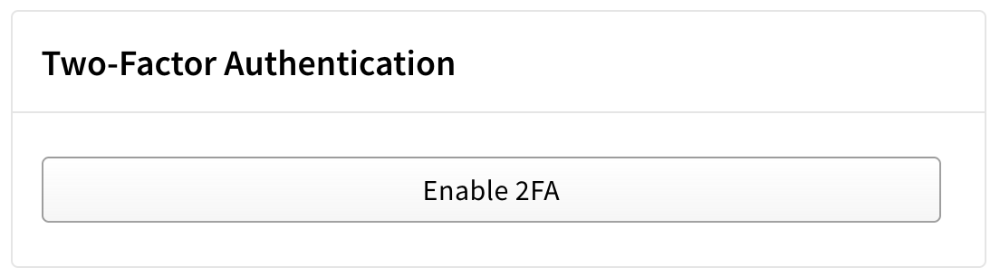
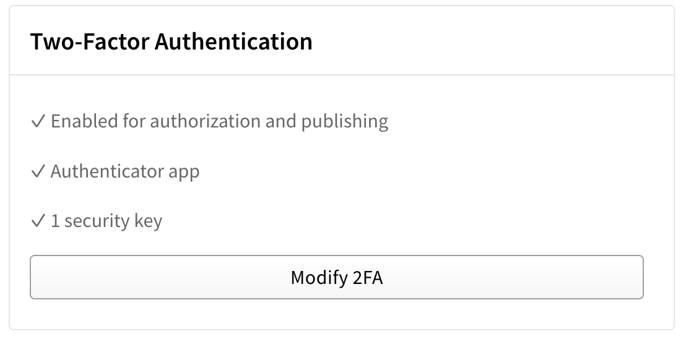
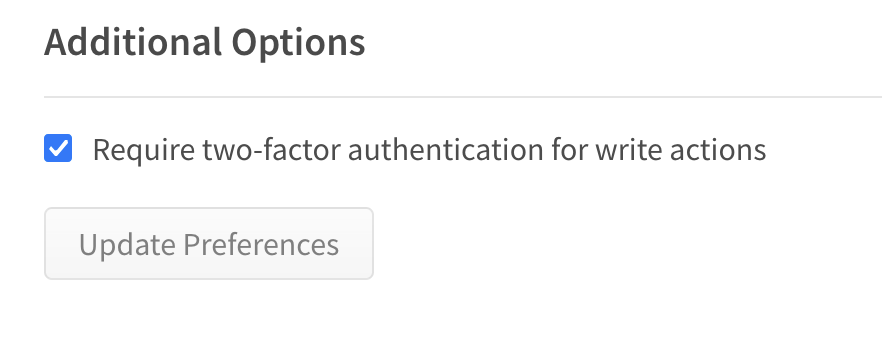

# Publishing Locally

Publishing locally can be both secure, reliable, and preferred for a number of cases. As you can see in this example
project, publishing locally supports secure 2FA workflows, reliable test running before publish, and additional hooks
for remembering to do all of the little security details.

While it is *simple* and *secure* to setup, you do need to be sure to set a few settings correctly.

## npm Account Settings

Ensure 2FA is on your npm account by going to your Account settings page. There is a section which will say "Enable 2FA"
when your account has not yet set it up (see below). Click that button and setup one of the supported 2FA options.



If you have already setup 2FA you will see a section that says "Modify 2fa" along with your setup 2FA methods. This
means you are ready to publish with 2FA.



Lastly, there is a setting hidden at the bottom of the "Modify 2FA" settings page to require 2FA for *all write
actions* on your account. You must also ensure this box is checked.




## How To Publish

As with publish from CI, the goal here is to automate the workflow so you don't need to remember everything to do in
each step. With this in mind, all the steps of the release workflow are in `package.json` scripts. To run this workflow
you can do either of the following:

```bash
$ npm run release [version] [tag]
$ node --run release [version] [tag]
```

This example workflow will do the following in order:

1. Run your tests
2. Version based on the first argument (`patch`, `minor`, `major`, `1.0.0`, etc)
3. Login to npm (you should always be logged out on your machine)
4. Publish with a dist tag from the second argument
5. Logout of your local npm session (important and easy to forget)
6. Push your git tags
7. Create a draft Release on Github

